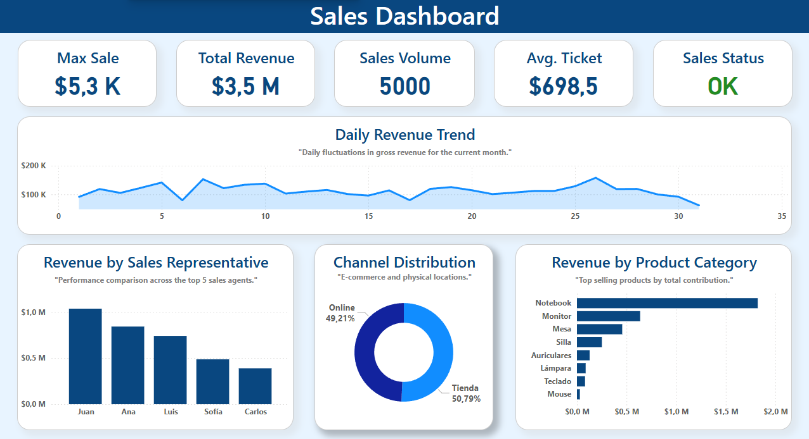
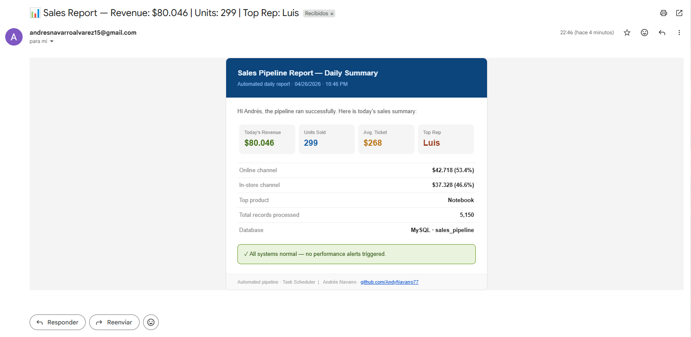

# 📊 Pipeline de Datos de Ventas — Analítica de Negocio End-to-End

> **Pipeline ETL que transforma datos crudos de ventas en inteligencia estratégica — desde una fuente Excel hasta un dashboard interactivo en Power BI, con KPIs automatizados, alertas de rendimiento y un reporte HTML diario entregado cada mañana por email.**

[](https://python.org)
[](https://mysql.com)
[](https://powerbi.microsoft.com)
[]()
[]()
[]()

---

## 🧠 El Problema de Negocio

La mayoría de las empresas acumula datos de ventas en archivos Excel, sistemas desconectados o reportes manuales. El resultado:

- **Sin visibilidad en tiempo real** sobre ingresos, volumen o rendimiento por vendedor
- **Decisiones basadas en intuición** en lugar de datos actuales
- **Ineficiencias operativas** que pasan desapercibidas hasta que es tarde
- **Oportunidades de crecimiento perdidas** ocultas dentro de datos transaccionales crudos

Un gerente comercial no debería esperar el reporte semanal para saber que un vendedor está por debajo del promedio o que una categoría de producto genera el 60% de los ingresos.

**Este pipeline elimina ese punto ciego.**

---

## ✅ La Solución

Un pipeline de datos end-to-end que simula un entorno de negocio real: nuevos registros de ventas se generan e ingresan diariamente, se limpian y enriquecen, se agregan por dimensiones clave de negocio, se cargan en una base de datos relacional y se presentan en un dashboard interactivo — con un reporte HTML profesional entregado automáticamente cada mañana y alertas integradas que se disparan cuando un vendedor cae por debajo del umbral.

> *Cada día el dataset crece, los KPIs se actualizan y el reporte llega al inbox — exactamente como una operación de ventas real.*

---

## 📐 Arquitectura del Sistema

```
┌─────────────────┐    ┌──────────────────┐    ┌─────────────────┐
│  Archivo Excel  │───▶│  Python ETL      │───▶│   MySQL DB      │
│  (ventas.xlsx)  │    │  etl_ventas.py   │    │  (5 tablas)     │
└─────────────────┘    └──────────────────┘    └────────┬────────┘
                                                         │
                              ┌──────────────────────────▼──────────┐
                              │         Dashboard Power BI           │
                              │  (KPIs · Tendencias · Rendimiento)   │
                              └─────────────────────────────────────┘
                                         │
              ┌──────────────────────────┼──────────────────────────┐
              │                          │                           │
     ┌────────▼────────┐       ┌─────────▼──────────┐               │
     │ Task Scheduler  │       │  Motor de Alertas + │               │
     │ (Ejecución diaria)      │  Reporte por Email  │               │
     └─────────────────┘       └────────────────────┘               │
```

---

## 🔄 Pipeline — Paso a Paso

| Paso | Acción | Tecnología | Valor de Negocio |
|------|--------|------------|------------------|
| 1 | Generar e ingestar nuevos registros de ventas diariamente | Python · openpyxl | Simula datos operativos reales — el dataset crece en cada ejecución |
| 2 | Limpiar, tipar y calcular revenue | Python · pandas | Garantiza datos consistentes y listos para análisis |
| 3 | Generar agregaciones de negocio | Python · pandas | Vistas pre-construidas por día, producto, vendedor, canal |
| 4 | Detectar vendedores con bajo rendimiento | Python · pandas | Alerta proactiva antes del descubrimiento manual |
| 5 | Generar reporte diario estructurado | Python | Revenue, unidades, ticket promedio, top vendedor, top producto, split por canal |
| 6 | Cargar transacciones + agregaciones a MySQL | SQLAlchemy · SQL | Base de datos centralizada — 5 tablas |
| 7 | Enviar reporte HTML por email | Python · smtplib | Briefing diario profesional entregado automáticamente al inbox |
| 8 | Visualizar KPIs y tendencias | Power BI | Insights listos para la toma de decisiones |
| 9 | Ejecución automática diaria | Windows Task Scheduler | Cero intervención manual |

---

## 📊 Dashboard

El dashboard en Power BI fue diseñado para usuarios de negocio — cada vista responde una pregunta operativa específica:



**Qué muestra:**

- **KPI Cards:** Venta Máxima · Revenue Total · Volumen de Ventas · Ticket Promedio · Estado de Ventas
- **Tendencia de Revenue Diario** — gráfico de línea temporal con fluctuaciones del mes
- **Revenue por Vendedor** — barras rankeadas para identificar top y bottom performers al instante
- **Distribución por Canal** — split Online vs. Tienda (donut chart)
- **Revenue por Categoría de Producto** — barras horizontales rankeando productos por contribución total

---

## ✉️ Prueba Real — Funciona en Producción

Este pipeline no es solo código — se ejecuta en producción todos los días via Task Scheduler. Nuevos registros se agregan en cada ejecución, los KPIs se actualizan automáticamente, y este reporte llega al inbox cada mañana:



**Qué incluye el reporte diario:**
- Revenue del día · Unidades vendidas · Ticket promedio · Top vendedor
- Split por canal Online vs. Tienda con porcentajes
- Producto top por revenue
- Total de registros procesados
- Estado de alertas — verde si todo normal, amarillo si hay bajo rendimiento

> Los números cambian todos los días porque el dataset está vivo — 30 nuevos registros de ventas se ingresan en cada ejecución, simulando actividad de negocio real.

---

## 🔔 Motor de Alertas Integrado

El pipeline evalúa el rendimiento del negocio automáticamente en cada ejecución:

**Detección de bajo rendimiento por vendedor** — si el revenue de algún vendedor cae por debajo del 50% del promedio:
```
⚠ Low performance detected: [Nombre del Vendedor]
```

**Ventas por debajo del promedio total** — si el revenue total cae por debajo del promedio histórico:
```
⚠ Sales below average threshold
```

Ambas alertas se incluyen directamente en el reporte por email — en verde (todo normal) o amarillo (acción requerida).

---

## 💡 Resultados y Valor Generado

| Antes | Después |
|-------|---------|
| Revisión manual de Excel para seguimiento | Agregaciones automáticas por vendedor, producto, canal, día |
| Sin visibilidad sobre vendedores de bajo rendimiento | Alertas nominadas disparadas automáticamente en cada ejecución |
| Snapshots estáticos sin análisis de tendencias | Dashboard interactivo con serie temporal completa |
| Cálculos de revenue hechos a mano | Pipeline calcula revenue, ticket promedio y volumen automáticamente |
| Sin briefing diario para gerencia | Reporte HTML profesional entregado cada mañana |
| Datos aislados en archivos Excel | Base de datos MySQL centralizada lista para cualquier herramienta BI |

---

## 🛠️ Stack Tecnológico

| Capa | Tecnología | Propósito |
|------|------------|-----------|
| Generación de Datos | Python · numpy · random | Simulación realista — 5.000+ registros, crece diariamente |
| Extracción | Python · openpyxl | Ingesta de Excel con actualizaciones incrementales |
| Transformación | Python · pandas | Limpieza, cálculo de revenue, tipado |
| Agregación | Python · pandas | Vistas pre-construidas: por día, producto, vendedor, canal |
| Almacenamiento | MySQL 8.0 · SQLAlchemy | Schema relacional de 5 tablas — transacciones + agregaciones |
| Visualización | Power BI | Dashboard interactivo y reportes de KPIs |
| Alertas | Python (integrado) | Detección de umbrales de rendimiento en cada ejecución |
| Reporte | Python · smtplib | Reporte HTML por email con KPIs en vivo |
| Programación | Windows Task Scheduler | Ejecución automatizada diaria |

---

## 📁 Estructura del Repositorio

```
Sales-Pipeline/
│
├── etl_ventas.py              # ETL principal — extraer, transformar, agregar, alertar, enviar, cargar
├── generar_datos_ventas.py    # Generador de datos — 5.000 registros de ventas realistas
├── requirements.txt           # Dependencias Python
├── schema.sql                 # Schema MySQL — listo para desplegar
├── .env.example               # Template de variables de entorno (sin credenciales)
├── LICENSE                    # Licencia MIT
├── dashboard/
│   └── dashboard_ventas.pbix  # Archivo Power BI
├── data/
│   ├── ventas.xlsx            # Fuente de datos — crece en cada ejecución del pipeline
│   ├── ventas_limpio.csv      # Transacciones limpias
│   ├── ventas_por_dia.csv     # Agregación: revenue diario
│   ├── ventas_por_producto.csv# Agregación: por producto
│   ├── ventas_por_vendedor.csv# Agregación: por vendedor
│   └── ventas_por_canal.csv   # Agregación: por canal
├── img/
│   ├── sales_dashboard.png    # Captura del dashboard
│   └── email_report.png       # Captura del reporte diario por email
└── README.md                  # Versión en inglés
```

---

## 👤 Autor

**Andrés Navarro**
Analista de Datos · BI · ETL · Python · SQL

[](https://github.com/AndyNavarro77)
[](https://www.linkedin.com/in/andr%C3%A9s-navarro77/)
[](https://andres-navarro-portfolio.netlify.app/)

---

*Construido para simular un escenario de negocio real donde los datos impulsan las decisiones diarias — demostrando ingeniería de datos end-to-end, reportería automatizada y analítica orientada al negocio aplicable a cualquier organización orientada a ventas.*